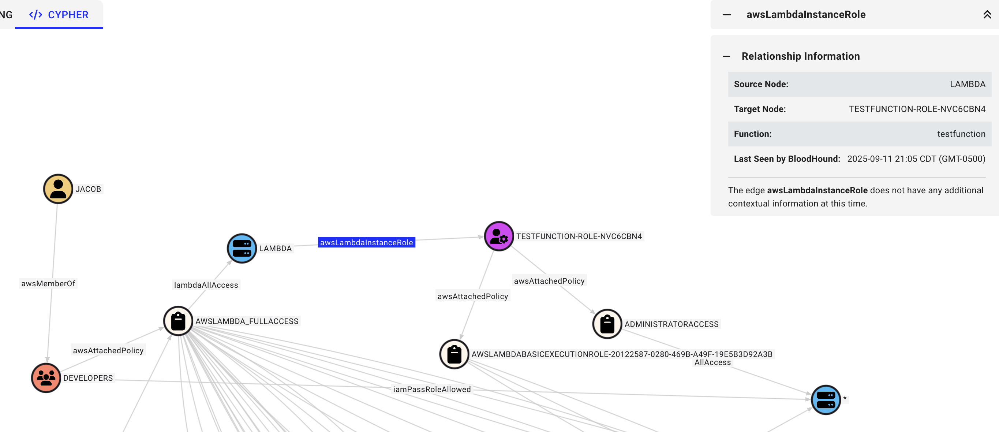
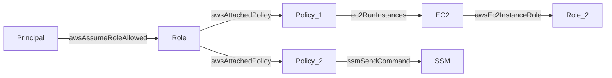

# IAMhounddog

A tool to help pentesters quickly identify privileged principals and second-order privilege escalation opportunities in unfamiliar AWS environments.




https://github.com/user-attachments/assets/e60db9c6-75ee-45f9-83fb-0b58f5683ceb


## Usage

Requires an AWS principal with either SecurityAudit or ReadOnlyAccess.

1. Download and setup [BloodHound Community Edition](https://bloodhound.specterops.io/get-started/quickstart/community-edition-quickstart)
1. Install via `go install github.com/VirtueSecurity/IAMhounddog@latest`
1. (Optional) In BloodHound, go to Profile > API Key Management > Create Token
1. (Optional) Run `$ IAMhounddog -setup -url "http://localhost:8080" -id "KEYIDFROMSTEPABOVE" -token "KEYTOKENFROMSTEPABOVE"` to install the node icons and the bundled Cypher queries
1. Run `$ IAMhounddog` with environment variables set (`export AWS_ACCESS_KEY_ID=...`) or an AWS profile (`-profile`)
1. Import `output.json` into BloodHound using Administration > File Ingest
1. Run queries against the data

### Options

| Flag | Description |
| --- | --- |
| `-profile` | AWS profile to use. Uses environment variables if not provided. |
| `-regions` | Comma-separated list of AWS regions (tries all regions if not provided). Use `-regions describe` to use AWS described regions enabled for the account. |
| `-output` | Output file name. Defaults to `output.json`. |
| `-onlyroles` | Only enumerate IAM roles, users, groups, and trust relationships. |
| `-onlyservices` | Only enumerate service-attached roles. |
| `-setup` | Install node icons and bundled queries. Used with `-url`, `-id` and `-token`. |

## Second-Order Privilege Escalation Opportunities

There are currently multiple tools (such as [Cloudsplaining](https://github.com/salesforce/cloudsplaining)) that effectively identify first-order privilege escalation opportunities. A classic example would be attaching a policy to a role that includes the `iam:PutRolePolicy` permission or attaching the `AdministratorAccess` policy to a principal. Second-order opportunities occur when a principal may not have direct access to these escalation paths, but can abuse other seemingly-benign permissions to get to them.

For example, in the screenshot at the top of this README, `testfunction-role-nvc6cbn4` has the `AdministratorAccess` policy applied. `Jacob` is a member of the `Developers` group. The `Developers` group only has the `AWSLAMBDA_FULLACCESS` policy attached. Most current tools would correctly identify the `testfunction-role-nvc6cbn4` role as over-permissioned. However, a manual review is required to identify that this role is attached to a Lambda function which the `Developers` group can modify and, due to group permissions, `Jacob` can modify. This tool eliminates that manual review step and allows pentesters to accurately assess permission relationships in large AWS accounts.

## Coverage

IAMhounddog identifies relationships across:

- IAM roles, users, and groups
- Attached and inline policies
- Trust relationships, including foreign principals
- Roles attached to the following services:
    - EC2
    - ECS
    - EKS
    - Lambda
    - RDS
    - Step Functions
    - CloudFormation
    - CodeBuild
    - CodePipeline
    - Bedrock AgentCore
    - SageMaker
    - Glue
- Cognito identity pools
- S3 buckets and bucket policies

## AI Usage

In addition to use in BloodHound, the outputted JSON file from IAMhounddog can also be used in AI pipelines. An example agent prompt is shown below:

```
Examine the iamhounddog json file. This file is available in the local directory. This iamhounddog file contains BloodHound-compatible OpenGraph formatted data. It contains the following nodes:

- AWSRole
- AWSUser
- AWSGroup
- AWSPrincipal
- AWSPolicy
- AWSResource

and the following edges:

- Principals are linked to roles usually through awsAssumeRoleAllowed or iamPassRoleAllowed edges.
- Roles are linked to policies through awsAttachedPolicy edges.
- Policies are attached to resources using actions as the edges, like ec2RunInstances. * is remapped to AllAccess due to the schema not liking * in edge names, so s3:* becomes s3AllAccess. Edge names are case sensitive.
- Resources are attached to instance roles through edges unique to the relationship, like awsEcsTaskRole.

Identify all AWS privilege escalation paths for all principals. This includes the ability for a role to assume another role or access resources it should not have access to. Also include second-order privilege escalation paths, such as a role writing to lambdas that have an attached role that allows for more permissions than the original role.

For each privilege escalation path record:

- The starting role
- What privilege escalation paths exist and what roles or data they allow access to
- The responsible permissions documents that are misconfigured
- Proof-of-concepts for how the escalation could occur
- Any mitigations present

Write complete findings to `privilege_escalation.md`
```

The same context window can then be queried in normal language for potential paths, like `can the EXAMPLE role access sensitive functionality`.

## Data Model

The data model produced by the tool conforms to the OpenGraph schema.



Nodes are resources that exist in AWS, including roles, users, policies, and resource categories (like EC2):

- AWSRole
- AWSUser
- AWSGroup
- AWSPrincipal
- AWSPolicy
- AWSResource

Edges link these resources together:

- Principals are linked to roles usually through awsAssumeRoleAllowed or iamPassRoleAllowed edges.
- Roles are linked to policies through awsAttachedPolicy edges.
- Policies are attached to resources using actions as the edges, like ec2RunInstances. `*` is remapped to `AllAccess`, due to the schema not liking `*` in edge names, so `s3:*` becomes `s3AllAccess`.
- Resources are attached to instance roles through edges unique to the relationship, like awsEcsTaskRole.

## Credits

IAMhounddog was created by Nathan Tucker and is proudly released by [Virtue Security](https://www.virtuesecurity.com/).

### About Virtue Security

Virtue Security is a specialized cybersecurity firm offering in-depth security testing services including:
- Application Penetration Testing
- Cloud Penetration Testing
- Kubernetes Penetration Testing
- Network Penetration Testing

Visit [Virtue Security](https://www.virtuesecurity.com/) to learn more about their security services.
